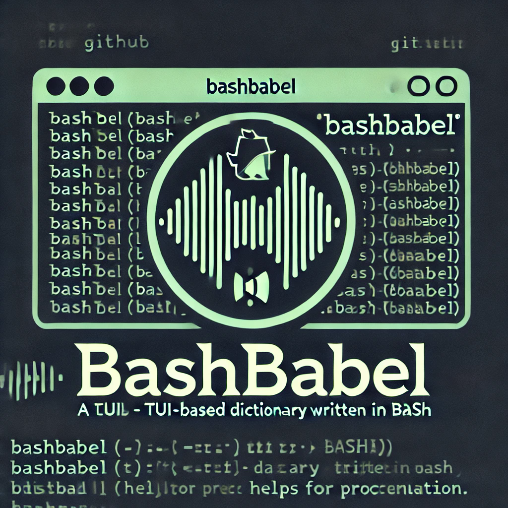

# BashBabel

<br>
<br>




<br>
<br>

- This is a simple __terminal based dictionary__ written to help you understand things when you read your pdfs and books from terminal. 📚

- Uses `mpv` and an opensource `api` which you can find in the code. Json parsing is done using `jq` :).


## Installation ⚒

<br>

- Git clone

```bash
git clone https://hail0hydra/BashBabel
```

- Go into the directory

```bash
cd BashBabel
```

- Simple run the program :)

```bash
./meaning.sh 
```

---
